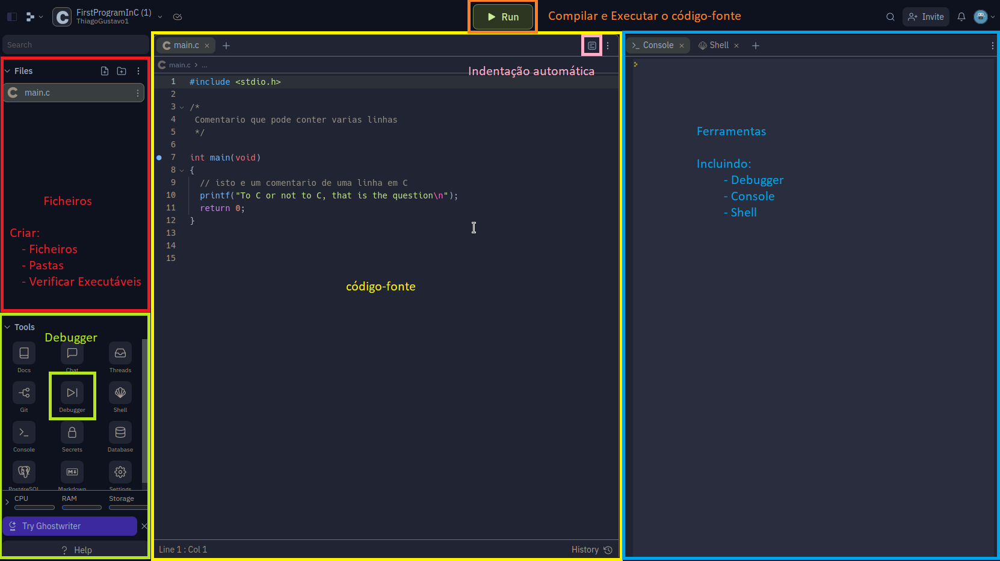
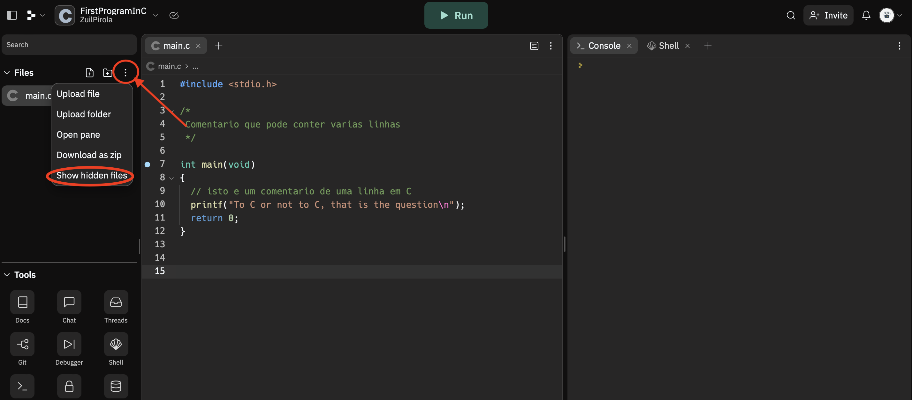
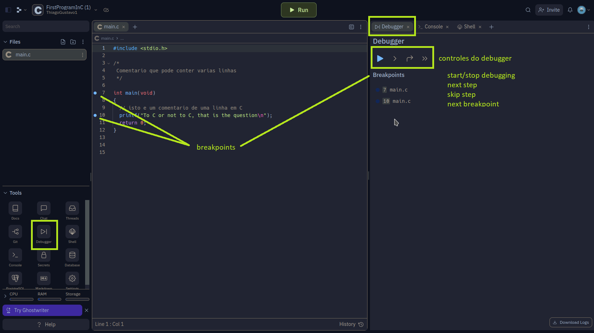

**UNIVERSIDADE LUSÓFONA DE HUMANIDADES E TECNOLOGIAS**


# Ficha de Exercícios - 1 - Introdução ao replit.com

**Objetivo:** esta ficha tem como objetivo familiarizar-se com o WSL+VsCode ou alternavamente Replit e a forma de escrever, compilar e executar um programa. Irá aprender igualmente aspectos básicos do C. Finalmente, realizará um conjunto de exercícios de código C, explorando tipos de variáveis e usando as funções de leitura e escrita. 

## Interface do VSCode no WSL

Sigam os seguintes videos.

1 - Instalar WSL
https://youtu.be/L6vhzhQkLX8?si=QfqiISWyitkdj95K

2 - Configurar o VSCode 
https://youtu.be/f9V8xmyrUrU?si=5GHRgaJrzx-MB7de

3 - Correr o Hello World
https://youtu.be/GR6DHz0UKxM?si=FqZDHZFPvt_toDx8


## Interface do Replit



<!---
*O **Exercício 8** deverá ser submetido na platadorma PANDORA. A classificação obtida na plataforma será contabilizada na componente de avaliação contínua.*
--->

## Exercício 1
*	Aceda ao site https://replit.com/ e crie um conta
*	Aceda a https://replit.com/@PedroSerra/FirstProgramInC e pressione o botão **Fork repl**
1.	Implemente agora o pequeno e famoso código do “Hello world”:
Escreva (não copie!) o seguinte código:
```
#include <stdio.h>

/* Isto e um comentário. Multi-linha
Primeiro programa
na linguagem C.  */

int main (void)
{
    // isto e um comentario so de uma linha
    printf("Hello World!\n"); 
    return 0;
}

```
3.	Compile e execute o programa pressionando o botão **Run**
4.	Na consola de terminal - consola lateral
5.	Escreva a instrução para compilar o código:
```gcc -Wall -Wpedantic -Wextra -Wvla -g main.c -o main``` ou ...



...edite o arquivo tal como descrito abaixo:


5.	Execute o código:
6.	```./main```

Sugestões: 
*	Na escrita de código, respeite sempre a indentação (colocação de novas linhas e texto “avançado”). 
*	Não utilize carateres com acentos ou “ç”, pois não são reconhecidos pelo compilador.
*	Nunca copie código escrito em processadores de texto. Muitas vezes código editado em processadores de texto ficam com as aspas desformatadas, em vez de " " fica “ ”. Exemplo: printf("Hello World!\n"); é diferente de printf(“Hello World!\n”); (se não percebeu a diferença, leia novamente com atenção!)

## Introdução ao Debugger
O debugger (depurador) é um programa usado para testar outro programa e fazer sua depuração, que consiste em encontrar os defeitos do programa. O Replit possui um compilador integrado



Como utilizar:
1.	Na barra lateral pressione o ícon do Debugger
2.	Coloque um breakpoint (ponto de paragem de execução) numa determinada instrução do código, clicando ao lado do numero de uma linha do código. Aparecerá uma bola azul ao lado do número da linha. Pode adicionar tantos breakpoints quantos queira.
3.	Uma vez o código escrito, premir o ícon Play   . 
	*	O código executará até ao primeiro breakpoint onde a execução será interrompida. 
	*	Na barra lateral esquerda, em baixo, poderá ver as variáveis existentes e seus valores
4.	Os comandos de controlo do debugger são:
	*	  correr até ao próximo breakpoint, ou até ao fim se não houver mais breakpoints (F5).
	*	 executar a próxima instrução (F10)
	*	 pula o passo atual
	*	 parar (Shift + F5)

## Exercício 2
Crie um novo replit (usando o precimento do Fork como foi feito anteriormente) com o seguinte código:
```
#include <stdio.h>
int main (void)
{
    /* Declaracao de dados */
    int centenas;
    int dezenas;
    int unidades;
    int numero;
    
    /* Processamento e apresentação de resultados */
    centenas = 3;
    dezenas = 5;
    unidades = 2;

    printf("Este programa congrega, num numero, %d centenas, %d dezenas e %d unidades\n", centenas, dezenas, unidades);

    numero = centenas*100+dezenas*10+unidades*1;

    printf("Resultado: %d\n", numero);
    return 0;
}
```

Faça os seguintes passos:
*	Insira um breakpoint na declaração da variável centenas. 
*	Corra o debugger.
*	veja o valor de todas as variáveis. Os valores são espectáveis?
*	Execute linha a linha para ver o que acontece na zona de variáveis. 

### Exercício 3
Crie um novo replit (usando o precimento do Fork como foi feito anteriormente) e insira o seguinte código
```
#include <stdio.h>
int main() 
{
    Char c = 'r' 
    short j = 127; 
    int k 32767; 

    printf("c= %c\n", c); 
    c=C+1;
    Printf("c= %c\n, c); 
    c=c+1; 
    printF("c= %c\n", c); 
    printf("j= %d\n", j); 
    j=j-1;
    printf("j= %d\n", j); 
    j++; 
    printf("j= %d\n", j); 
    printf("k= %d\n", k); 
    k -=4;
    printf("k= %d\n", k); 
    k = k+5; 
    printf("k= %d\n", k); 
    printf("Valores finais:\n\tc = %c\n\tj = %d",c,j); 
    printf("\n\tk = %d\n\n", k);
    printf("y= %d\n", y); 
    return 0;
}
```
1.	No editor, vários identificadores estão sublinhados a vermelho. É o editor a indicar que existe um erro nessa instrução.
2.	Corrija todos os erros sintácticos do programa, pois o programa no estado atual não compila. 
3.	Execute com o debugger, verificando instrução a instrução o que acontece às variáveis.
 
### Exercício 4
Examine o programa seguinte para calcular a média de avaliação contínua:
```
#include <stdio.h>
int main() 
{
    int notaTeste1 = 15, notaTeste2 = 15, notaTeste3 = 17; 
    double media;

    media = (notaTeste1 + notaTeste2 + notaTeste3)/3;
    printf("Nota final : %f valores\n", media);
    return 0;
}
```

1.	Compile, corra o programa e examine a sua saída.  Concorda com o resultado? O que terá acontecido?
2.	Substitua a instrução do cálculo da média pela instrução seguinte e observe o que é escrito pelo programa. 
          media = (notaTeste1 + notaTeste2 + notaTeste3)/3.0;
3.	Na instrução printf substitua %f por %3.0f e observe o resultado.
4.	Na instrução printf substitua %f por %3.2f e observe o resultado


### Exercício 5
O programa seguinte usa o tipo de dado elementar short:
```
# include <stdio.h>
int main() 
{
    short valor= 32; 
    int tamanho;

    tamanho = sizeof(valor);
    
    printf("Um short int : %d\n",valor); 
    printf("espaco de memoria ocupado: %d bytes\n", tamanho);
    return 0;
}
```
1.	Compile e execute o programa. O que aparece escrito no monitor? 
2.	Edite o programa e altere o valor 32 para um outro valor inteiro relativamente baixo, digamos 100. Compile e corra o programa. 
3.	Altere o valor para 90000 e tente compilar o programa. O que é que acontece? Porquê?
4.	Edite o programa e altere a palavra “short” para “int”. Compile e corra o programa. Qual a diferença entre esta e a alínea anterior?

## Exercício 6
O programa seguinte usa o tipo de dado elementar float:
```
#include <stdio.h>
int main() 
{
    float valor= 900.25;
    int tamanho;

    tamanho = sizeof(valor);
    printf("Um float : %f\n",valor); 
    printf("espaco de memoria ocupado: %d bytes\n", tamanho);
    return 0;
}
```
1.	Compile e execute o programa. O que aparece escrito no monitor?
2.	O que irá aparecer no monitor se alterar o especificador de formato de %f para %E.
3.	E se alterar para %e?

## Exercício 7
O programa seguinte usa o tipo de dados elementar char:
```
#include <stdio.h>
int main() 
{
    char ch = 'A'; 
    printf("Um char : %c\n", ch); 
    printf("Outro char : %c\n", ch + 32); 
    printf("O carater %c tem o codigo ASCII %d\n", 100, 100);  
    return 0;
}
```
1.	Compile e execute o programa. O resultado é o espectável, imprime o carater 'A' e seu código ASCII? Corrija o erro.
2.	Troque o 'A' por 'Z' compile e corra o programa. 
3.	O que irá aparecer no monitor se alterar o especificador de formato de %c para %d. (Nota: o código ASCII do carácter ‘Z’ é 90)

<!---
[comment] ## Exercício 8 - Pandora

[comment]1.	Aceda à plataforma PANDORA (https://saturn.ulusofona.pt/).
[comment]2.	Para conseguir fazer o login deverá ter uma conta no github (https://github.com/). Se criar uma conta nova no github deverá usar o seu email institucional e colocar o seu nome e número mecanográfico como nome de utilizador. Exemplo ```anasilva21908445```.

[comment]*Nota. O acesso ao Pandora é feito com as credenciais do github. Isso significa que o Pandora não guarda passwords. A única informação que é passada ao Pandora é o vosso nome de utilizador.*
[comment]**Se perder a password, deve recuperar a password utilizando o mecanismo disponibilizado pelo github. NUNCA DEVERÁ CRIAR UMA CONTA NOVA.**
[comment]**Se criar uma conta nova irá perder todas as avaliações feitas pelo pandora.**

[comment]3.	Após login no PANDORA, clickar em Contests, e depois completar a informação colocando o número e o nome completo.

[comment]4.	Peça ao professor para activar a sua conta.

[comment]5.	Escreva o serguinte programa num ficheiro .c.
[comment]```
[comment]#include <stdio.h>

[comment]int main() 
[comment]{
[comment]	int numero;
[comment]	int resultado;
[comment]	
[comment]	print("Insira um numero\n");
[comment]	scanf("%d", &numero)
[comment]
[comment]	resultado = numero * 2;
[comment]    
[comment]	print("Numero = %d, Numero*3 = %d\", numero, resultado);
[comment]
[comment]}
[comment]```
Sem alterar absolutamente nada, submeta o ficheiro no PANDORA no contest: IC2021EX0. **O Objectivo deste exercício não é que o aluno obtenha classificação máxima à primeira submissão. O objectivo é que o aluno submeta o código com erros e depois os corrija. Desta forma estará a familiarizar-se com a plataforma**

6.	Verifique a classificação obtida e os erros de compilação reportados pelo PANDORA. Para isso clique na cruz vermelha.

7.	Corrija os erros de compilação e submeta de novo e verifique a nota obtida.

8.	O programa deverá ler um número e imprimir esse número multiplicado por 3. Verifique os resultados dos testes e observe toda a informação disponibilizada. Utilizando essa informação, altere o código e submeta de novo até obter a classificação de 20 Valores.
--->
